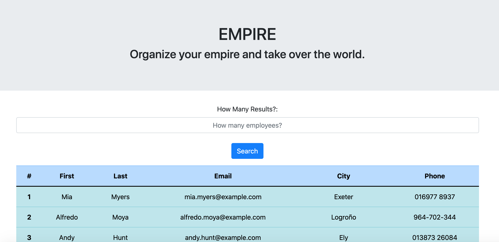

# Empire: Reactive Employee Manager

- [DESCRIPTION](#description)
- [INSTALLATION](#installation)
- [USAGE](#usage)
- [CONTRIBUTIONS](#contributions)
- [TESTS](#tests)
- [QUESTIONS](#questions)

- []
  (https://opensource.org/licenses/ISC)

---

## DESCRIPTION

This app uses React to grab employees from an API and create a table of said employees with various personal data from the API. It allows management to get info from their employee pool."

---

### INSTALLATION

Simply navigate to the github deployment url and start using the app. Link HERE>>> https://swhachey.github.io/reactive_employee_manager/ For developers, you will need to run an npm i for all of the depenedencies to start working.

---

### USAGE

Just type into the form how many results you'd like and the app wil generate a pool of employees.

Link to video of how to use app >> https://drive.google.com/file/d/1WbH_AWzpoMdOk217Sfgnb0hNnOxfrTQA/view

---

### CONTRIBUTIONS

React, express, mongoose, github, axios

---

### TESTS

None yet

---

### QUESTIONS

You can reach the developer for additional info or questions by contacting them via GitHub (swhachey) or email (swhachey@gmail.com)

---

### LICENSES

This app is covered under the license ISC. (https://opensource.org/licenses/ISC)

